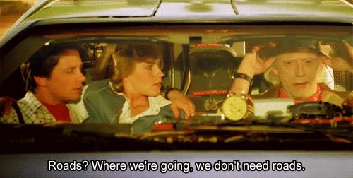

#### Un exemple avec Yeoman et AngularJS

---

### Un peu d'histoire...

---
<!-- .slide: data-autoslide="2000" -->

### C'est quoi Yeoman?
### <span class="fragment" data-fragment-index="1" data-autoslide="2000">C'est quoi Angular?</span>

---

### De quoi va t'on avoir besoin?

* NodeJS: serveur d'application JavaScript
* npm: Manageur de paquets JS
* Git (à défaut de RTC)

---

Installation de Yeoman

```bash
$ npm install --global yo
```

Vérifier l'installation

```bash
$ yo --version
```

---

### Installation du generateur AngularJS (mais pas que...)

Ca gère ausssi les Modules, les preprocesseurs JS et les preprocesseurs CSS

```bash
$ npm install --global generator-fountain-webapp
```

---

### Création du projet

```bash
$ mkdir todo && cd todo
$ yo
```

---

Sélection du générateur et lancement


---


---


---

### Lancer notre projet

```bash
$ npm run serve
```

puis

http://localhost:3002

---


---

###Et dans la vraie vie?

---

On build le code avec la commande suivante

```bash
$ npm run build
```

---

#### Architecture d'Angular

* On marche avec le patron de conception MVC
* on utilise autant de controleurs que nécessaires


---

##Et concrètement?

---

### Le code de l'application

```html
<!DOCTYPE html>
<html ng-app="tutoApp">
<head>
 <script src="Scripts/angular.js"></script>
 <script src="app.js"></script>
</head>
<body>
</body>
</html>
```

---

### Le contrôleur

```javascript
var app = angular.module('tutoApp', ['fruitModule']);
var fruitModule = angular.module('fruitModule', []);
fruitModule.controller('fruitController', ['$scope', function ($scope) {

}]);
```

---

### Qu'est ce qu'on fait de tout ça?

```javascript
fruitModule.controller('fruitController', ['$scope', function ($scope) {
   $scope.fruit = {
        Nom: "pomme",
        Couleur: "rouge",
        Peremption: new Date()
	};
}]);
```

```html
<body ng-controller="fruitController">
La {{fruit.Nom}} de couleur {{fruit.Couleur}} périme le {{fruit.Peremption}}
</body>
```

---

### Les filtres

```javascript
fruitModule.filter("dateFilter", ['$filter', function ($filter) {
    return function (input) {
        date = $filter('date')(new Date(input), 'dd/MM à HH:mm');
        return date;
    }
}]);
```

On l'utilise ensuite dans notre code avec : ```{{fruit.Peremption | dateFilter}}```

---

### Et si j'ai plusieurs fruits?

```javascript
$scope.fruits = 
        [{
            Nom: "pomme",
            Couleur: "rouge",
            Peremption: new Date()
        },
        {
            Nom: "poire",
            Couleur: "verte",
            Peremption: new Date()
        },
        {
            Nom: "prune",
            Couleur: "violette",
            Peremption: new Date()
        }];
```

```html
<ul>
<li ng-repeat="fruit in fruits">la {{fruit.Nom}} de couleur {{fruit.Couleur}} périme le {{fruit.Peremption | dateFilter}}</li>
</ul>
```

---

### Et si j'ai plusieurs fruits à plusieurs endroits?

```javascript
fruitModule.directive("fruitDirective", function () {
    return {
        template: "La {{fruit.Nom}} de couleur {{fruit.Couleur}} périme le 
        {{fruit.Peremption | dateFilter}}"
    };
})
```

```html
<ul>
<li ng-repeat="fruit in Fruits | orderBy : 'Nom'" fruit-directive></li>
</ul>
```

---

### Un panier pour acheter des fruits...

```javascript
$scope.panier = [];
$scope.ajouterFruitAuPanier = function (fruit) {
        $scope.panier.push(fruit.Nom);
};
```

```html
<ul>
 <li ng-repeat="fruit in Fruits | orderBy : 'Nom'">
   <fruit-directive></fruit-directive>
    <button ng-click="ajouterFruitAuPanier(fruit)">Ajouter le fruit au panier</button>
 </li>
</ul>
Mon panier contient : {{panier}}
```

---

### Dans la vraie vie

```javascript
fruitModule.controller('panierController', ['$scope', function ($scope) {
    $scope.panier = [];
}])
```

```html
<body>
<div ng-controller="fruitController">
<ul>
 <li ng-repeat="fruit in Fruits | orderBy : 'Nom'">
    <fruit-directive></fruit-directive>
    <button ng-click="ajouterFruitAuPanier(fruit)">Ajouter le fruit au panier</button>
 </li>
</ul>
</div>
<div ng-controller="panierController">
   Mon panier contient : {{panier}}
</div>
</body>
```

---

### Les services

```javascript
fruitModule.service("fruitService", [function () {
    this.panier = [];

    this.ajouterFruitAuPanier = function (fruit) {
        this.panier.push(fruit.Nom);
    }
}]);
```

```javascript
fruitModule.controller('fruitController', ['$scope', 'fruitService', function ($scope, fruitService) {
}]);

fruitModule.controller('panierController', ['$scope', 'fruitService', function ($scope, fruitService) {
}])
```

---

###Et dans la vraie vie véritable des gens de tous les jours?

---

### Spécs de notre webservice (1/3)

enregistrer un todo

```javascript
>> POST /api/<user>/todo
{
    "value": "aller chercher les enfants ce soir",
    "done": false
}

<< HTTP/1.0 204 CREATED
```

---

### Spécs de notre webservice (2/3)

récupérer les todos enregistrés

```javascript
>> GET /api/<user>/todos

<< {
    "1" : {"value": "faire les courses", "done": true},
    "2" : {"value": "acheter un cadeau pour la fête des pères", "done": false},
    "3" : {"value": "rendez_vous à la banque", "done": true}
}
HTTP/1.0 200 OK
```

---

### Spécs de notre webservice (3/3)

effacer un todo enregistré

```javascript
>> DELETE /api/<user>/todo?id=84

<< HTTP/1.0 204 NO_CONTENT
```

---

##Mais pourquoi on ne l'utilise plus alors?

---

### Le Futur



---

* Angular 2.X et 4.X (Non compatible avec Angular 1)
* ReactJS (Facebook)
* VueJS (Alibaba)
